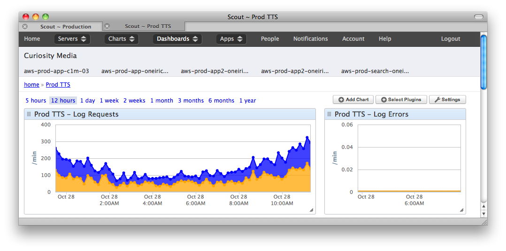

Zero to Node: Node.js in Production
===================================

* * * * *

## Goal
### Show one way to do Node.

* There are many. This was ours.

* Full Disclosure: I'm still learning.

* For expert advice, the internet is your best bet.

* * * * *

## The Problem

* Teaching a language means teaching pronunciation.

* Users want to learn how to pronounce arbitrary text.

* We have a command-line TTS application.

* But our legacy PHP app to generate audio is broken.

* * * * *

## The Solution

### A node.js app.

* Ryan and Chris assert: **Node.js can do this**.

* Me: OK.

* Thus was born **cicero**.

* * * * *

## Yikes!

* Lots of users!
* New stack and framework!
* Async!

* * * * *

## What's This App Really Doing?

* Taking in a string and:

    * serving from cache, or
    * generating an mp3, serving to user, and caching

* In other words, **slinging data**. Node can do that really well.

* * * * *

## Getting started

Install is easy enough...

<pre>$ brew install node
$ git clone git://github.com/creationix/nvm.git ~/nvm
$ . ~/nvm/nvm.sh
$ nvm use v0.8.9
</pre>

Check nodejs.org for other platforms.

* * * * *

## Dependencies

Node has **lots** of third-party packages.

Here's what I started with in `package.json`:

    # [some boilerplate...]
    "dependencies": {
       "config": "0.4.15",
       "express": "3.x",
       "underscore": "1.3.3",
       "deep-extend": "0.2.2",
       "validator": "0.4.10",
       "winston": "0.6.2"
     },
     "devDependencies": {
       "coffee-script": "1.3.3",
       "jshint": "0.7.1",
       "coffeelint": "0.4.0"
     }

Then just do:

    $ npm install

* * * * *

## Modules

Require'ing is dead simple.

    express = require("express")

Modules are just js files.

    utils = require("./common/utils")

* * * * *

## Dev Environment

* Coffeescript: a must (for me).

<pre><code class="javascript">// JavaScript               # CoffeeScript

fn = function (args) {      fn = (args) ->
  return args;                args
};

var obj = {                 obj =
  key: value                  key: value
};
</code>
</pre>

* Grunt: watch, test, server.

* REPL? Eh.

* * * * *

## Config

`node-config` provides per-environment config.

In `project_root/config`:

* `default.js`, `development.js`, `production.js`
* `node-config` chooses based on `NODE_ENV` environment variable.

Sample:

    config =
      app:
        addr: process.env.ADDRESS or "0.0.0.0"
        port: process.env.PORT    or 8004
      tts:
        input:
          maxChars: 200
        languages:
          available: ["en", "es"]

    module.exports = config

* * * * *

## Connect and Express

Middleware (Connect) and HTTP framework (Express).

Provides:

* Routes:

<pre><code class="coffeescript">app.get '/audio', (req, res) ->
   # Do route callback.
</code></pre>

* Middleware:

<pre><code class="coffeescript">middle = (req, res, next) ->
   # Process req, res. Call next.
   next()
</code></pre>

* Very flexible flow of control.

* * * * *

## Structure and Decomposition

Really up to you. Here's our project layout:

    /cicero
       |-config
       |    |--default.js
       |    |--development.js
       |-docs
       |-lib
       |  |--server
       |      |--index.js
       |      |--tts.js
       |-node_modules ...
       |-src
          |-config
          |   |--default.coffee
          |   |--development.coffee
          |-server
              |--index.coffee
              |--tts.coffee

* * * * *

## Structure and Decomposition

**`index.(coffee|js)`**

* docstring
* requires
* logger config
* app creation and config
* routing

* * * * *

## Structure and Decomposition

**`tts.(coffee|js)`**

* config
* `TtsArgs`
* `TtsExec`
* `TtsCache`

* * * * *

## Structure and Decomposition

At bottom of `tts.(coffee|js)`, `Tts*` objects expose middleware: fns with
signature `(req, res, next)`:

<pre><code class="coffeescript">module.exports =
  parseArgs:   TtsArgs.parse
  searchCache: TtsCache.search
  exec:        TtsExec.exec
</code></pre>

In `index.(coffee|js)`:

<pre><code class="coffeescript">tts = require "./tts"
# ...

middle = [log, tts.parseArgs, tts.searchCache, tts.exec]

app.get "/audio", middle
</code></pre>

* * * * *

## Async

* I started doing fs operations with sync methods like `fs.openSync`.

* But why is that a problem?

* Node is single-threaded.

* Anything that blocks can halt the entire process.

* * * * *

## Callbacks

First async paradigm.

<pre><code class="coffeescript">fs.open path, 'r', (err, file) ->
  # Do something with file now that it's ready.
</code></pre>
* * * * *

## Events

Second async paradigam.

    # Create our process object.
    process = spawn TTS, args, options

    # Listen for error event.
    stderr = ""
    process.stderr.on "data", (data) ->
      # Accumulate data.
      stderr += data

    # Listen for exit event.
    process.on "exit", (code) ->
      # Check errors, exit.
      if stderr or code isnt 0
        return new Error(stderr ? "TTS failed")

* * * * *

## Streams

* Streams are a powerful way of thinking about IO.
* Streams can be readable, writeable, or both.
* Can pipe readable into writeable.
* Streams emit events:

    * Readable: a bunch of `data` events and one `end` event
    * Writeable: `drain`, `pipe`, `close` events

### Why use streams?

* Data comes and goes as fast as the OS can make it available.
* Avoid 'procrastination', i.e., buffering data in memory. Send it as
available/ready. Smooths out CPU and network load.
* Easy to reason about.

* * * * *

## Streams

Stream file to response (`res`) and S3 (`s3Stream`):

<pre><code class="coffeescript"># Get stream references to audio file and cloud (S3).
fileStream = fs.createReadStream tmpMp3File
s3Stream = getCloudStream(res)

# Set response header.
res.header 'Content-type', 'audio/mpeg'

# Let the streaming begin!
fileStream.pipe(res)
tmpStream.pipe(s3Stream)

# errHandle is defined elsewhere.
fileStream.on "error", errHandle
s3Stream.on "error", errHandle

fileStream.on "end", ->
  # Do cleanup...
</code></pre>

* * * * *

## Logging and Monitoring

Get visibility into what your app is doing.

* winston library
    * Allows multiple transports (e.g., console, filesystem, third-party service)
    * Logs JSON
<pre><code>{
  "date": "2012-10-28T15:17:02.513Z",
  "level": "info",
  "env": "production",
  "type": "server",
  "serverHost": "inkling",
  "serverId": "m",
  "serverPid": 99632,
  "serverName": "prod-server",
  "addr": "0.0.0.0",
  "port": 2003,
  "vers": "v0.8.9",
  "deploy": "cicero",
  "message": "Server started on port 2003."
}
</code></pre>

* Monitoring services can read the logs, too.

* * * * *

## Provision and Deploy

* Many ways you could do this.
* We use Chef and AWS.
* Find Chef cookbooks online and customize when necessary.
* Time to deploy? Update version and Chef takes of the rest.

* * * * *

## Monitoring

* Again, many ways to do this.
* We use a service called Scout.
* Scans output from logging.

* * * * *

## Challenges

* Thinking async.
* Newness/rapid development.
* DIY / FIOY (figure it out yourself).
* Minimalism sometimes extends to docs!

* * * * *

## Links

#### Docs
* Node docs: http://nodejs.org/api (Make sure to get right version, Google is often behind!)
* Express docs: http://expressjs.com

#### Community
* Nodejitsu: http://docs.nodejitsu.com
* How to Node: http://howtonode.org

#### Chef
* nodejs cookbook: http://community.opscode.com/cookbooks/nodejs
* node app cookbook: http://community.opscode.com/cookbooks/node

* * * * *

## Thanks!

@williamjohnbert

http://williamjohnbert.com

SpanishDict is hiring! http://spanishdict.com/careers
